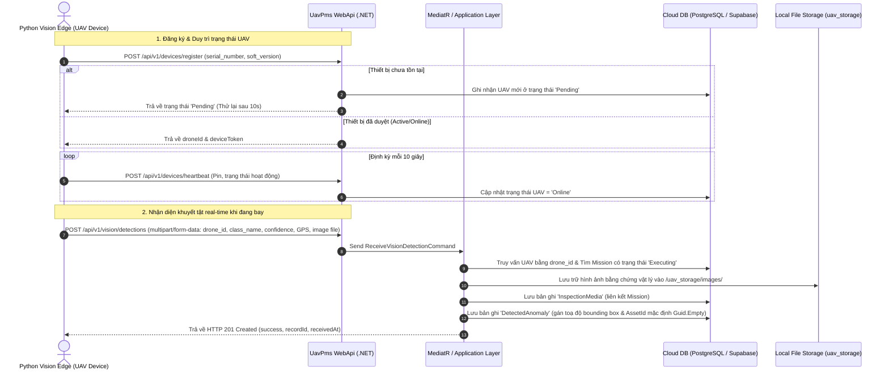
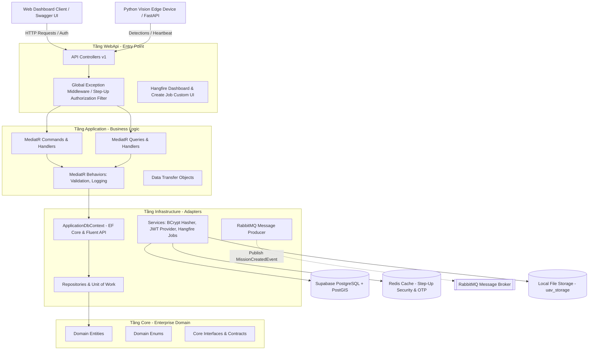
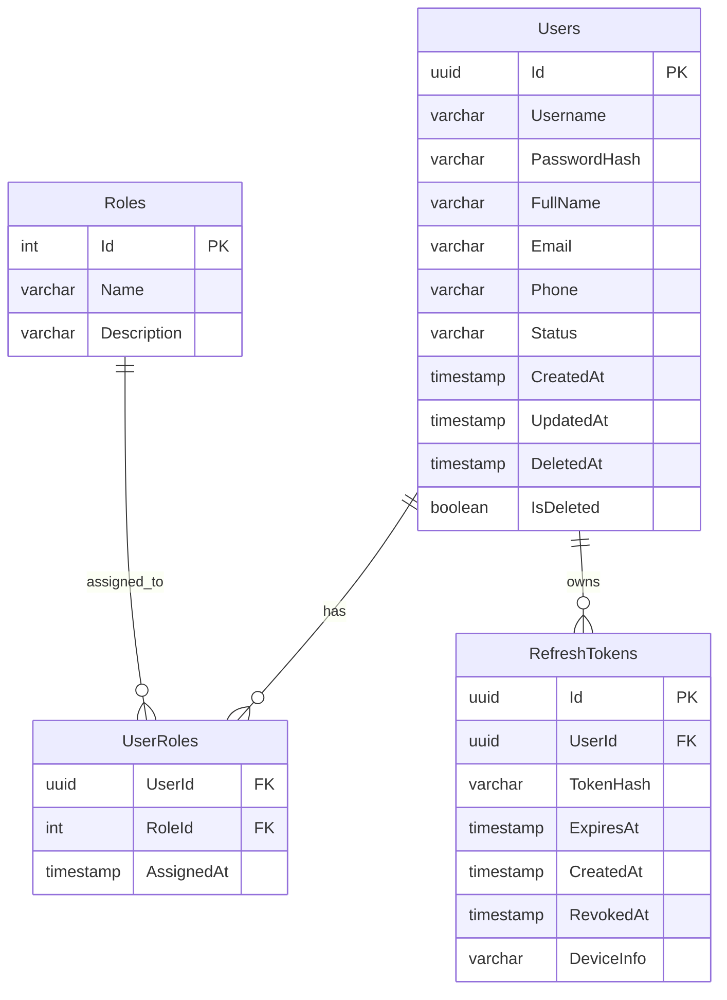
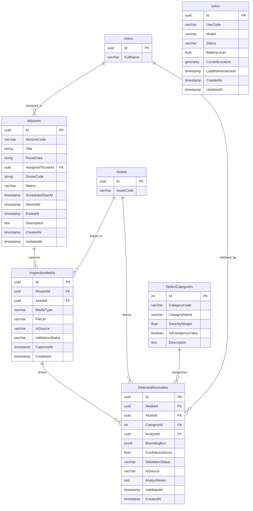
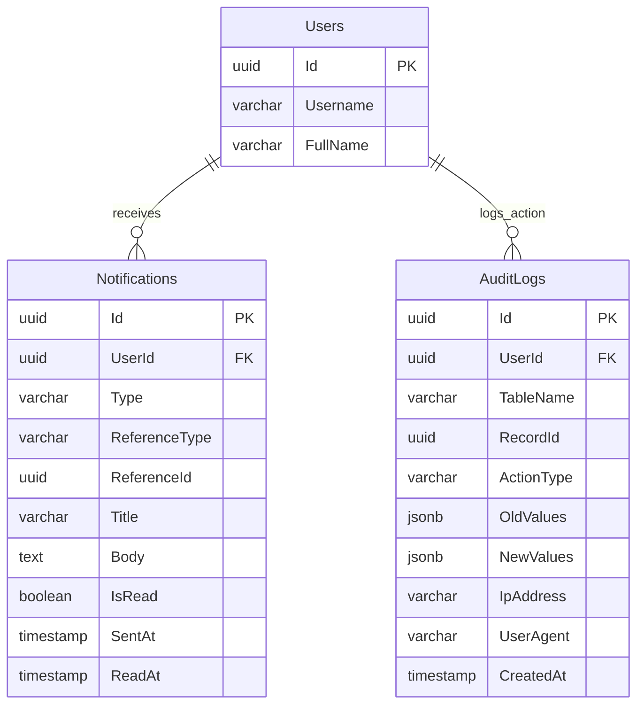

# BÁO CÁO ĐỀ TÀI DỰ ÁN PRN232 - UAV-PMS SYSTEM

**Lớp**: PRN232  
**Học kỳ**: Summer 2026  
**Thời gian thực hiện**: Từ ngày 24/06/2026 đến ngày 21/07/2026  

(*) Chuyên ngành: **\<Software Engineering\>**  
(*) Hình thức đăng ký: Nhóm sinh viên thực hiện  

---

## 1. Thông tin Giảng viên hướng dẫn (Supervisor Information)

| # | Họ và Tên | Số điện thoại | E-Mail | Học hàm / Học vị |
| - | --------- | ------------- | ------ | ---------------- |
| GVHD | Đặng Ngọc Minh Đức | 0989699299 | ducdnm2@fe.edu.vn | Assoc. Prof. / PGS.TS |

## 2. Thông tin Sinh viên thực hiện (Student Information)

| # | Họ và Tên | Mã sinh viên | Số điện thoại | E-mail | Vai trò |
| - | --------- | ------------ | ------------- | ------ | ------- |
| 1 | Nguyễn Quốc Khánh | SE193464 | 0708462865 | khanhnqse19@gmail.com | Leader |
| 2 | Phạm Hoàng Minh Châu | SE193418 | 0963274717 | phamhoangminhchau1973@gmail.com | Member |
| 3 | Nguyễn Nhật An | SE193338 | 0898520071 | an3439201@gmail.com | Member |
| 4 | Huỳnh Thái Liêm | SE193443 | 0932927074 | uselessliem@gmail.com | Member |

---

## 3. Nội dung Đề tài Dự án (Project Content)

### 3.1. Tên dự án (Project Name)

*   **Tên tiếng Anh**: UAV-GridGuard: Web-Based Management and Analysis System for 110kV Transmission Line Inspection
*   **Tên tiếng Việt**: Hệ thống UAV tích hợp AI để kiểm tra và quản lý bảo trì hạ tầng điện lực
*   **Tên viết tắt**: UAV-PMS (UAV Power-Grid Maintenance & Inspection System)

---

### Bối cảnh (Context)

Lĩnh vực vận hành lưới điện truyền tải đang đối mặt với yêu cầu nâng cao độ tin cậy cung cấp điện song song với tối ưu hóa chi phí bảo trì. Phương pháp kiểm tra lưới điện truyền thống phụ thuộc lớn vào kỹ thuật viên đi thực địa, tiềm ẩn nguy cơ mất an toàn lao động, năng suất thấp và dữ liệu bị rời rạc. Việc ứng dụng thiết bị bay không người lái (UAV) chụp ảnh và quay video lưới điện giúp giảm thiểu rủi ro, nhưng lại sinh ra khối lượng lớn dữ liệu hình ảnh cần phân tích thủ công, tạo nên nút thắt cổ chai về mặt thời gian và nhân lực.

Các giải pháp hiện nay thường bị phân mảnh: quy trình điều phối bay, lưu trữ dữ liệu hình ảnh, phát hiện lỗi tự động và lập lịch sửa chữa nằm trên các phần mềm riêng biệt. Để giải quyết vấn đề này, dự án **UAV-PMS** xây dựng một hệ thống backend đồng bộ bằng hệ sinh thái **.NET 9**, cung cấp các RESTful API kết hợp hệ thống xử lý tác vụ chạy ngầm (**Hangfire**), truyền nhận thông điệp bất đồng bộ (**RabbitMQ**), và giao tiếp dịch vụ biên AI ngoài (**Python Vision Edge**) nhằm tự động hóa tối đa quy trình từ khi lập kế hoạch bay, tiếp nhận hình ảnh kiểm định khuyết tật lưới điện, cho đến khi ghi nhận thông tin phân tích.

---

### Đối tượng sử dụng & Các bên liên quan (Target Customers / Stakeholders)

*   **Công ty Truyền tải điện / Đơn vị vận hành lưới điện**: Chủ quản lý tài sản lưới điện, cần giám sát tổng thể hiệu suất và mức độ an toàn của đường dây.
*   **Đội ngũ Quản lý sửa chữa (Manager)**: Thực hiện CRUD tài sản lưới điện, phân công chuyến bay giám sát UAV, và kiểm tra báo cáo kỹ thuật.
*   **Kỹ sư vận hành UAV (Inspector)**: Điều khiển drone thực địa, nhận lịch trình chuyến bay được giao, upload dữ liệu log bay và tệp đa phương tiện (ảnh/video) lên hệ thống.
*   **Kỹ thuật viên phân tích lỗi (Analyst)**: Đánh giá kết quả nhận diện tự động từ AI, duyệt/bác bỏ các khuyết tật được phát hiện.
*   **Nhóm kỹ thuật hiện trường (Technician)**: Nhận phiếu sửa chữa, thực hiện khắc phục lỗi trực tiếp tại các cột điện và báo cáo vật tư tiêu hao.

---

### Giải pháp kỹ thuật đã triển khai (Proposed & Implemented Solution)

Hệ thống backend đã hiện thực hóa trọn vẹn luồng nghiệp vụ cốt lõi theo mô hình Clean Architecture kết hợp các công nghệ phân tán:

#### A. Kiến trúc Tích hợp Thiết bị biên AI (Vision Edge Integration)
Hệ thống triển khai cơ chế giao tiếp Service-to-Service trực tiếp giữa Thiết bị biên (chạy Python FastAPI) và Backend (.NET API) qua giao thức HTTP REST:

1.  **Tự động đăng ký UAV (UAV Auto-Registration)**: Khi dịch vụ AI trên Edge khởi chạy, nó gửi thông tin phần cứng về backend. Nếu UAV chưa tồn tại, hệ thống tự động lưu UAV dưới trạng thái `Pending` chờ quản trị phê duyệt.
2.  **Cơ chế Nhịp tim (Heartbeat Service)**: Cứ sau mỗi 10 giây, UAV gửi cập nhật mức pin và trạng thái kết nối, cập nhật trực tiếp vào cơ sở dữ liệu để quản lý giám sát thời gian thực.
3.  **Tự động kết hợp dữ liệu Chuyến bay (Automatic Flight Mapping)**: Khi UAV gửi hình ảnh phát hiện lỗi trong quá trình bay, backend tự động bắt cặp `drone_id` với `Mission` đang có trạng thái `Executing` tương ứng của drone đó. Ảnh được lưu vào thư mục vật lý `uav_storage/images/`, đồng thời tạo các bản ghi [InspectionMedia](file:///home/an/RiderProjects/UavPms_Org/docs/database_schema.md#L141-L151) và [DetectedAnomalies](file:///home/an/RiderProjects/UavPms_Org/docs/database_schema.md#L163-L176) liên kết trực tiếp với Mission và Asset trung gian (`Guid.Empty`).

#### B. Sơ đồ Kiến trúc Hệ thống (System Architecture)

Dự án được cấu trúc theo mô hình **Clean Architecture (CQRS)** phân chia nhiệm vụ rõ ràng giữa các tầng dữ liệu và nghiệp vụ:

*   **WebApi**: Chứa các API endpoints định nghĩa phiên bản (API Versioning v1), bọc dữ liệu qua wrapper chuẩn `ApiResponse`, áp dụng middleware bắt lỗi tập trung (`ProblemDetails`) và Hangfire Dashboard.
*   **Application**: Triển khai CQRS sử dụng MediatR. Áp dụng Pipeline Behavior để tự động hóa việc validate dữ liệu đầu vào (FluentValidation) và ghi nhật ký hoạt động (Logging Behavior).
*   **Infrastructure**: Triển khai cấu hình kết nối PostgreSQL + PostGIS (NetTopologySuite) để lưu trữ tọa độ địa không gian `geom`, triển khai các tác vụ chạy ngầm với Hangfire, bảo mật JWT/BCrypt, và tích hợp RabbitMQ gửi thông điệp bất đồng bộ.
*   **Core**: Tầng nhân trung tâm chứa định nghĩa các thực thể thực tế (Entities), bảng liên kết trung gian, Enums nghiệp vụ và hợp đồng giao tiếp (Interfaces).

---

### Các tính năng hệ thống đã hiện thực (Implemented Features)

Tính đến thời điểm hiện tại, các tính năng sau đây đã được cài đặt hoàn tất và kiểm thử thành công trong mã nguồn:

#### 1. Module Xác thực & Phân quyền (Identity & Access Control)
*   **Đăng nhập & Cấp phát Token**: `POST /auth/login` kiểm tra hash mật khẩu bằng `BCrypt` và sinh cặp JWT Access Token (hạn ngắn) + Refresh Token (hạn dài) tương ứng. Tích hợp giải pháp chống tấn côngtiming (Timing Attack Protection) thông qua kiểm tra hash giả lập đối với các tài khoản không tồn tại.
*   **Multi-Device Session Management**: Tách bảng [RefreshTokens](file:///home/an/RiderProjects/UavPms_Org/docs/database_schema.md#L99-L103) riêng biệt để quản lý nhiều phiên làm việc song song trên nhiều thiết bị của cùng một người dùng mà không bị ghi đè dữ liệu.
*   **Đổi mật khẩu bảo mật cao (Step-Up Authentication)**: `POST /users/change-password` áp dụng bộ lọc `[RequireStepUp]`. Người dùng bắt buộc phải gửi Step-Up Token hợp lệ (được xác thực thông qua mã OTP lưu tạm thời trên Redis) để thực hiện đổi mật khẩu.
*   **Quản trị Tài khoản (Users CRUD)**: Dành riêng cho `SystemAdmin` để tạo mới người dùng, chỉnh sửa phân vai trò (SystemAdmin, Manager, Inspector, Analyst, Technician) và đình chỉ (`Suspend`) tài khoản.

#### 2. Module Phân cấp Tài sản Lưới điện (Asset Registry Core)
*   Đồng bộ hóa 100% cấu trúc dữ liệu địa không gian lưới điện hỗ trợ PostGIS:
    *   **Vùng miền (Regions)**: `POST /regions` định vị vùng không gian.
    *   **Trạm biến áp (Substations)**: `POST /substations` phân cấp trực thuộc vùng miền, lưu giữ thông tin cấp điện áp (`VoltageLevel`).
    *   **Đường dây truyền tải (Transmission Lines)**: `POST /lines` liên kết các trạm biến áp, xác định đường dây huyết mạch (`IsCriticalEdge`).
    *   **Cột điện (Towers)**: `POST /towers` quản lý vị trí toạ độ địa lý cột qua NetTopologySuite `Point` (SRID 4326).
    *   **Thiết bị gắn trên cột (Assets)**: `POST /assets` lưu thông tin tình trạng vận hành, phân loại loại thiết bị (Bát sứ Insulator, Dây cáp Cable, Thanh giằng, v.v.), điểm sức khoẻ hiện tại và mức độ rủi ro tương ứng.
*   **Nhập dữ liệu cột điện hàng loạt (Excel Bulk Import)**: `POST /towers/import` tiếp nhận file Excel danh sách toạ độ cột điện, tự động phân tích và thêm hàng loạt thực thể `Towers`, đồng thời sinh mặc định các `Assets` tương ứng gắn trên mỗi cột điện để tiết kiệm thời gian khởi tạo.

#### 3. Module Điều phối Chuyến bay & UAV (Flight & Mission Coordination)
*   **Đăng ký & Heartbeat UAV**: Hỗ trợ tiếp nhận thông tin UAV gửi về từ Edge tự động đăng ký và cập nhật định kỳ mức pin, trạng thái hoạt động trực tiếp trong DB.
*   **Quản lý lịch trình bay (Missions CRUD)**: Manager lên kế hoạch chuyến bay, đặt mã chuyến bay (`MissionCode`), chỉ định thiết bị UAV thực thi, phân công kỹ sư phụ trách (Inspector), lưu giữ tọa độ hướng tuyến (`RouteData`) và cập nhật trạng thái chuyến bay (`Pending` -> `InProgress` -> `Completed`).
*   **Tác vụ gửi tin nhắn bất đồng bộ**: Khi tạo thành công chuyến bay, backend tự động bắn sự kiện `MissionCreatedEvent` thông qua RabbitMQ Broker.
*   **Lấy danh sách chuyến bay cá nhân**: `GET /missions/my` cho phép các phi công UAV (Inspector) đăng nhập để truy xuất danh sách chuyến bay được phân công riêng cho mình.

#### 4. Module Cầu nối Dữ liệu AI ngoài (Vision Bridge Integration)
*   **Webhook tiếp nhận lỗi**: `POST /vision/detections` tiếp nhận yêu cầu multipart/form-data gửi trực tiếp từ camera AI UAV, lưu ảnh và tạo quan hệ lỗi liên quan.
*   **API test cục bộ**: `POST /vision/detections/json` tiếp nhận dữ liệu định dạng JSON phục vụ kiểm thử nhanh luồng tạo khuyết tật giả lập.

#### 5. Module Tác vụ chạy ngầm & Thông báo (Background Jobs & Notifications)
*   **Hangfire Background Processing**: Tích hợp dashboard Hangfire tại địa chỉ `/hangfire`. Thiết lập 02 tác vụ chạy ngầm định kỳ:
    *   `auto-cleanup-job`: Tự động dọn dẹp các log cũ và tệp tin tạm thời trong hệ thống quá 30 ngày.
    *   `daily-summary-job`: Chạy cuối ngày để tổng hợp danh sách lỗi và giả lập gửi email báo cáo kỹ thuật.
*   **Giao diện tự thiết lập lịch tác vụ (Custom Create Job Dashboard)**: Xây dựng màn hình `/hangfire/create-job` cho phép tạo nhanh các lịch gửi thông báo in-app đến các tài khoản người dùng hoặc gửi đồng loạt tới toàn bộ người dùng đang hoạt động trong hệ thống.
*   **Notification CRUD**: Quản lý lịch sử thông báo nội bộ, đánh dấu đã đọc (`PUT /notifications/{id}/read`) và xóa thông báo.

#### 6. Module Giám sát Tổng quan (Dashboard Monitor Queries)
*   **Chỉ số tổng hợp**: `GET /monitor/summary` trả về thống kê số lượng chuyến bay theo từng trạng thái, tổng số ảnh chụp kiểm tra, và tổng số lỗi khuyết tật phát hiện.
*   **Duyệt khuyết tật gần đây**: `GET /monitor/recent-defects` phân trang danh sách lỗi mới được phát hiện. Áp dụng kiểm tra ràng buộc kích thước trang (`pageSize <= 100`) chống cạn kiệt tài nguyên máy chủ.
*   **Thống kê & Lịch sử**: Cung cấp biểu đồ thống kê khuyết tật lưới điện (`defects-statistics`), tỷ lệ chuyến bay (`mission-status`), và lịch sử kiểm định (`inspections`) hỗ trợ bộ lọc đa điều kiện (MissionId, IsDefect, khoảng thời gian).

---

### Sơ đồ thực thể liên kết hiện tại (Implemented Entity Relationship Diagram)

Sơ đồ ERD thể hiện các thực thể cốt lõi đã được xây dựng và ánh xạ thành công vào cơ sở dữ liệu PostgreSQL (Supabase) thông qua Entity Framework Core Migrations. Do cơ sở dữ liệu có quy mô lớn và nhiều mối liên kết phức tạp, cấu trúc ERD dưới đây được phân tách thành 4 phân hệ nhỏ để đảm bảo tính trực quan và dễ dàng theo dõi trên các công cụ hiển thị:

#### 1. Phân hệ Xác thực & Phân quyền (Identity & Access Control Subsystem)

#### 2. Phân hệ Phân cấp Tài sản Lưới điện (Asset Hierarchy Subsystem)

```mermaid
%%{init: { "er": { "layoutDirection": "LR" } }}%%
erDiagram
    Regions {
        uuid Id PK
        varchar RegionName
        geometry geom
        timestamp CreatedAt
    }

    Substations {
        uuid Id PK
        uuid RegionAssetId FK
        varchar SubstationName
        varchar VoltageLevel
        geometry geom
        timestamp CreatedAt
    }

    TransmissionLines {
        uuid Id PK
        uuid SubstationAssetId FK
        varchar LineName
        boolean IsCriticalEdge
        geometry geom
        timestamp CreatedAt
    }

    Towers {
        uuid Id PK
        uuid LineAssetId FK
        varchar TowerCode
        geometry geom
        timestamp CreatedAt
    }

    Assets {
        uuid Id PK
        uuid TowerId FK
        varchar AssetType
        varchar AssetCode
        varchar Status
        float CurrentHealthScore
        varchar RiskLevel
        timestamp LastInspectedAt
        timestamp CreatedAt
    }

    AssetHealthHistories {
        uuid Id PK
        uuid AssetId FK
        float HealthScore
        int ActiveDefectsCount
        jsonb CalculationLog
        varchar RiskLevel
        timestamp CalculatedAt
    }

    Regions ||--o{ Substations : "contains"
    Substations ||--o{ TransmissionLines : "comprises"
    TransmissionLines ||--o{ Towers : "has"
    Towers ||--o{ Assets : "hosts"
    Assets ||--o{ AssetHealthHistories : "logs"
```

#### 3. Phân hệ Chuyến bay & Dữ liệu khuyết tật (UAV, Mission & Defect Detection Subsystem)

#### 4. Phân hệ Thông báo & Nhật ký kiểm toán (Notifications & Auditing Subsystem)

---

### Phân tích Yêu cầu Phi chức năng & Bảo mật (Security & Non-Functional Specifications)

Hệ thống được thiết kế chặt chẽ đáp ứng các tiêu chuẩn an ninh và hiệu năng cần thiết cho một hệ thống vận hành thực tế:
1.  **Xác thực phân tầng & Bảo mật Đổi mật khẩu**: Ngăn ngừa chiếm đoạt tài khoản bằng cách yêu cầu Step-Up token (OTP gửi qua Email/SMS) được lưu trữ và kiểm soát thời gian hết hạn chặt chẽ trên Redis trước khi thay đổi các thông tin nhạy cảm.
2.  **Chống Timing Attack trong Đăng nhập**: Ngăn chặn kẻ tấn công dò tìm tài khoản tồn tại trong hệ thống bằng cách áp dụng thuật toán so sánh mật khẩu giả định với thời gian xử lý đồng đều (Dummy verification) đối với tài khoản không hợp lệ.
3.  **Validate dữ liệu đầu vào tự động (FluentValidation)**: Mọi API Request Command đều được kiểm soát định dạng, độ dài, khoảng giá trị trước khi đưa vào xử lý nghiệp vụ nhờ Pipeline Behavior của MediatR.
4.  **Bảo vệ cạn kiệt tài nguyên (Anti-DoS Pagination Safeguard)**: Ràng buộc chặt chẽ các truy vấn danh sách phân trang (không cho phép `pageSize` vượt quá 100), hạn chế tối đa nguy cơ truy xuất dữ liệu dung lượng lớn làm treo hoặc tràn bộ nhớ máy chủ.
5.  **Audit Trail toàn vẹn**: Sử dụng EF Core Interceptor tự động lưu lại các thay đổi dữ liệu của thực thể (ghi nhận các giá trị cũ - mới dưới dạng JSONB, lưu IP người dùng và trình duyệt gửi yêu cầu) phục vụ công tác thanh tra giám sát hệ thống.

---

### 3.2. Nội dung Chi tiết Sản phẩm Bàn giao (Deliverables & Technical Scope)

#### Sản phẩm phần mềm bàn giao (Software Deliverables)

| # | Thành phần / Module | Chi tiết và Trạng thái |
| - | ------------------- | --------------------- |
| 1 | **Clean Architecture Codebase** | Toàn bộ mã nguồn backend viết trên .NET 9 phân rã thành các layer: Core, Application, Infrastructure, WebApi và UnitTests. |
| 2 | **Database Migration Scripts** | Bản ghi EF Core Migrations thiết lập cấu trúc bảng Postgres kết nối mở rộng PostGIS không gian địa lý. |
| 3 | **Cầu nối API Python Edge** | Bộ API đầu cuối `VisionBridge` hỗ trợ multipart/form-data tiếp nhận dữ liệu hình ảnh, pin, GPS, bounding box từ UAV. |
| 4 | **Hangfire Dashboard & Custom Create UI** | Hệ quản trị tác vụ chạy ngầm trực quan tích hợp UI lên lịch thông báo tùy biến. |
| 5 | **RabbitMQ Broker Configuration** | Cấu hình Docker Compose dựng sẵn hàng đợi tin nhắn phục vụ bắn sự kiện chuyến bay được tạo. |
| 6 | **Tài liệu API Swagger/OpenAPI** | Tài liệu đặc tả endpoint chia phiên bản rõ ràng tại địa chỉ `/swagger`. |

#### Công nghệ và Thư viện sử dụng (Technology Stack)

*   **Ngôn ngữ & Nền tảng chính**: C# (.NET 9 / .NET 8)
*   **Hệ Quản trị Cơ sở Dữ liệu**: PostgreSQL (Supabase Cloud Database) + Redis (Lưu trữ và xác thực OTP/Step-Up token)
*   **Thư viện ORM**: Entity Framework Core + NetTopologySuite (PostGIS Spatial Integration)
*   **Kiến trúc & Điều phối nghiệp vụ**: CQRS Pattern (MediatR), Pipeline Behaviors (FluentValidation, Logging)
*   **Quản lý Tác vụ Chạy ngầm**: Hangfire
*   **Truyền nhận Thông điệp**: RabbitMQ (MassTransit / RabbitMQ Client)
*   **Bảo mật & Mã hoá**: JWT (JSON Web Token), BCrypt.Net
*   **Ghi nhật ký & Bắt lỗi tập trung**: Serilog/NLog, ProblemDetails (RFC 7807)
*   **Công cụ Container hóa**: Docker, Docker Compose

---

### Các tính năng dự kiến phát triển ngoài phạm vi hiện tại (Future Work / Out of Scope)

Các nghiệp vụ nâng cao nằm ngoài phạm vi thực thi của phiên bản hiện tại (đã được định hình cấu trúc dữ liệu trong DB nhưng chưa có API điều phối và logic nghiệp vụ xử lý):
1.  **Bộ máy tính điểm sức khỏe tài sản tự động (Asset Health Scoring Service)**: Chưa cài đặt logic công thức tính điểm sức khoẻ tự động (0-100) của Asset dựa trên trọng số nghiêm trọng của khuyết tật và lịch sử sửa chữa.
2.  **Hệ thống xử lý cảnh báo khẩn cấp (Emergency Alert & Escalation Workflow)**: Chưa cài đặt logic xác nhận nhanh cảnh báo khẩn cấp hoặc gửi yêu cầu leo thang (`EscalateAlertCommand`) từ Analyst lên Manager.
3.  **SignalR Real-Time Alert Pushes**: Chưa cấu hình Hub và SignalR Client để đẩy các popup cảnh báo âm thanh và vị trí lỗi khẩn cấp lên màn hình Dashboard của Analyst thời gian thực.
4.  **Luồng quản lý Phiếu bảo trì & Vật tư kỹ thuật (Maintenance Tickets & Material Logs)**: Phiếu sửa chữa bảo trì, nạp hình ảnh minh chứng sau sửa chữa của Technician (`MaintenanceProofs`) và khai báo vật tư tiêu hao (`MaterialLogs`) hiện mới chỉ dừng ở mức thiết kế DB và DTO, chưa cài đặt handler nghiệp vụ hoàn chỉnh.
5.  **Truy vấn Không gian Bản đồ GeoJSON**: API tìm kiếm tài sản trong khu vực viewport (`GetAssetsInBoundingBoxQuery`) và xuất dữ liệu khuyết tật ra GeoJSON phục vụ bản đồ nhiệt (Heatmap) LeafletJS.
6.  **Xuất báo cáo định dạng Excel/PDF**: Tích hợp QuestPDF và EPPlus để kết xuất báo cáo thống kê khuyết tật và vật tư kỹ thuật.

---

### Giả định của dự án (Project Assumptions)
*   Thiết bị bay UAV được cài đặt sẵn phần mềm Python Edge để nhận diện người/lỗi lưới điện, tự động gửi HTTP POST qua API Webhook được PMS công khai.
*   Hình ảnh khuyết tật tải về ban đầu sẽ mặc định gán vào mã tài sản ảo `Guid.Empty` cho tới khi Analyst thực hiện phân tích và đối chiếu gán vào cột điện thực tế trên bản đồ.

---

### Tài liệu Đặc tả Chức năng Thực tế (Functional Specification - Program)

Bảng dưới đây thống kê chi tiết các chức năng đã được cài đặt trong codebase phân chia theo quyền truy cập của các vai trò người dùng hiện tại:

#### 1. Vai trò: Quản trị viên hệ thống (SystemAdmin)

| Mã chức năng | Tên chức năng | Mô tả chi tiết chức năng | Endpoint API đã cài đặt |
| ------------ | ------------- | ------------------------ | ---------------------- |
| **SYS-01** | Tạo tài khoản người dùng | Tạo mới tài khoản nhân viên hệ thống và gán vai trò tương ứng | `POST /api/v1/users` |
| **SYS-02** | Xem danh sách tài khoản | Xem danh sách toàn bộ người dùng trong hệ thống (có phân trang & lọc) | `GET /api/v1/users` |
| **SYS-03** | Lấy chi tiết tài khoản | Xem thông tin chi tiết của một người dùng cụ thể bằng ID | `GET /api/v1/users/{id}` |
| **SYS-04** | Cập nhật tài khoản | Chỉnh sửa thông tin email, họ tên, số điện thoại, trạng thái và vai trò | `PUT /api/v1/users/{id}` |
| **SYS-05** | Đình chỉ tài khoản | Thay đổi trạng thái tài khoản thành "Suspended" để khóa truy cập | `POST /api/v1/users/{id}/suspend` |
| **SYS-06** | Tra cứu nhật ký hệ thống | Xem lịch sử thay đổi thực thể dữ liệu (Audit Logs) để kiểm soát an ninh | `GET /api/v1/audit/logs` |

#### 2. Vai trò: Quản lý sửa chữa (Manager)

| Mã chức năng | Tên chức năng | Mô tả chi tiết chức năng | Endpoint API đã cài đặt |
| ------------ | ------------- | ------------------------ | ---------------------- |
| **MGR-01** | Quản lý Phân cấp vùng miền | Thêm mới, sửa đổi thông tin và xoá bỏ Vùng miền truyền tải điện | `POST/PUT/DELETE /api/v1/regions` |
| **MGR-02** | Quản lý Trạm biến áp | Thiết lập và cập nhật các Trạm biến áp cùng cấp điện áp tương ứng | `POST/PUT/DELETE /api/v1/substations` |
| **MGR-03** | Quản lý Đường dây điện | Tạo mới đường dây, thiết lập thuộc tính đường dây truyền tải huyết mạch | `POST/PUT/DELETE /api/v1/lines` |
| **MGR-04** | Quản lý Cột điện | Thiết lập toạ độ địa lý và mã ký hiệu của Cột điện truyền tải | `POST/PUT/DELETE /api/v1/towers` |
| **MGR-05** | Import Cột điện từ Excel | Đọc file Excel chứa toạ độ và tự động sinh mặc định thiết bị gắn kèm | `POST /api/v1/towers/import` |
| **MGR-06** | Lập lịch & Phân công bay | Tạo chuyến bay kiểm tra lưới điện, gán UAV và phân công phi công | `POST/PUT/DELETE /api/v1/missions` |
| **MGR-07** | Xem danh sách chuyến bay | Tra cứu lịch trình và trạng thái các chuyến bay kiểm tra lưới điện | `GET /api/v1/missions` |
| **MGR-08** | Lấy danh sách kỹ sư bay | Lấy danh sách tài khoản Inspector hoạt động để phân công chuyến bay | `GET /api/v1/users/assignable` |
| **MGR-09** | Giám sát Dashboard tổng hợp | Xem thống kê số lượng lỗi, số lượng chuyến bay phục vụ điều hành | `GET /api/v1/monitor/summary` |

#### 3. Vai trò: Kỹ sư bay UAV (Inspector)

| Mã chức năng | Tên chức năng | Mô tả chi tiết chức năng | Endpoint API đã cài đặt |
| ------------ | ------------- | ------------------------ | ---------------------- |
| **INS-01** | Xem chuyến bay được giao | Truy xuất danh sách các lịch trình chuyến bay được phân công riêng | `GET /api/v1/missions/my` |
| **INS-02** | Cập nhật tiến độ bay | Thay đổi trạng thái chuyến bay thành cất cánh (`InProgress`) | `PUT /api/v1/missions/{id}/status` |

#### 4. Vai trò: Chuyên viên phân tích (Analyst)

| Mã chức năng | Tên chức năng | Mô tả chi tiết chức năng | Endpoint API đã cài đặt |
| ------------ | ------------- | ------------------------ | ---------------------- |
| **ANA-01** | Phân tích AI Ad-hoc | Tải lên hình ảnh/video riêng lẻ để kiểm tra khuyết tật từ AI | `POST /api/v1/ai-analysis/upload` |
| **ANA-02** | Xem chi tiết kết quả phân tích | Tra cứu danh sách lỗi nhận diện của tệp ad-hoc thông qua ID | `GET /api/v1/ai-analysis/{id}` |
| **ANA-03** | Giám sát lỗi khuyết tật | Xem danh sách lỗi được phát hiện phân trang trong mục giám sát | `GET /api/v1/monitor/recent-defects` |
| **ANA-04** | Thống kê khuyết tật | Xem biểu đồ thống kê khuyết tật lưới điện | `GET /api/v1/monitor/defects-statistics` |

#### 5. Vai trò chung (Mọi người dùng đã đăng nhập)

| Mã chức năng | Tên chức năng | Mô tả chi tiết chức năng | Endpoint API đã cài đặt |
| ------------ | ------------- | ------------------------ | ---------------------- |
| **GEN-01** | Xem thông tin cá nhân | Xem thông tin chi tiết về tài khoản đang đăng nhập hiện tại | `GET /api/v1/users/me` |
| **GEN-02** | Đổi mật khẩu | Đổi mật khẩu tài khoản sử dụng Step-Up token (OTP kiểm thực) | `POST /api/v1/users/change-password` |
| **GEN-03** | Xem hộp thư thông báo | Truy xuất lịch sử thông báo in-app gửi tới tài khoản người dùng | `GET /api/v1/notifications/history` |
| **GEN-04** | Đánh dấu thông báo đã đọc | Đánh dấu thông báo cụ thể là đã đọc | `PUT /api/v1/notifications/{id}/read` |
| **GEN-05** | Xóa thông báo | Loại bỏ thông báo khỏi danh sách cá nhân | `DELETE /api/v1/notifications/{id}` |

---

### Phân công nhiệm vụ đề xuất cho Nhóm sinh viên (Proposed Task Allocation)

Dưới đây là bảng phân công nhiệm vụ thực tế tương ứng với các phân hệ tính năng backend đã được xây dựng hoàn tất trên codebase:

| Thành viên | Vai trò thực hiện | Nhiệm vụ chi tiết đã hoàn thành trong codebase |
| ---------- | ----------------- | --------------------------------------------- |
| **Nguyễn Quốc Khánh** *(Leader)* | **Business Analyst & PM** | Xây dựng tài liệu đặc tả yêu cầu, thiết kế kịch bản kiểm thử API, theo dõi tiến độ các Epics trên roadmap, thiết lập tài liệu tích hợp API hệ thống. |
| **Phạm Hoàng Minh Châu** | **Backend Developer (Core & Security)** | Thiết kế kiến trúc Clean Architecture & CQRS; Hiện thực hoá hệ thống Authentication & RBAC bảo mật cao, thiết lập Multi-device Session với bảng RefreshTokens riêng biệt, cài đặt bộ lọc an ninh Step-Up token xác thực qua Redis cache; Override `SaveChanges` sinh dữ liệu Audit Logs kiểm toán tự động. |
| **Nguyễn Nhật An** | **Backend Developer (Assets & Integrations)** | Triển khai thiết kế cơ sở dữ liệu Postgres + PostGIS qua EF Core; Cài đặt CRUD phân cấp tài sản lưới điện (Regions, Substations, Lines, Towers, Assets); Xây dựng tính năng Import Cột điện hàng loạt từ Excel; Xây dựng API và cơ chế hoạt động cho module tiếp nhận dữ liệu AI `VisionBridge` và đăng ký/heartbeat thiết bị. |
| **Huỳnh Thái Liêm** | **Background Jobs & Notification Engineer** | Tích hợp thư viện Hangfire thiết lập các tác vụ chạy ngầm tự động dọn dẹp hệ thống và xuất báo cáo khuyết tật tổng hợp; Xây dựng giao diện Custom Create Job gửi thông báo đồng loạt cho người dùng; Triển khai Module Notification gửi thông báo in-app và gửi email thông qua Hangfire. |

---

### Chỉ số đánh giá hiệu năng (Key Performance Indicators - KPIs)

*   **Thời gian phản hồi API trung bình**: $< 1.5$ giây đối với các nghiệp vụ CRUD thông thường.
*   **Thời gian phản hồi đăng nhập chống timing attack**: Thời gian phản hồi cân bằng xấp xỉ nhau đối với trường hợp đăng nhập đúng tài khoản và sai tài khoản (khoảng sai lệch $< 50ms$).
*   **Độ chính xác dữ liệu không gian địa lý**: Tọa độ của các cột điện (`Towers`) và trạm biến áp (`Substations`) được định vị chính xác trên hệ bản đồ vệ tinh bằng kiểu dữ liệu không gian của PostGIS (SRID 4326).
*   **Độ tin cậy của tác vụ chạy ngầm**: Hàng đợi tác vụ Hangfire thực thi đúng chu kỳ thiết lập, lưu giữ lịch sử thực thi và lỗi chi tiết trong DB Supabase.
*   **Kiểm thử đơn vị (Unit Tests)**: Xây dựng các ca kiểm thử tự động trong project `UavPms.UnitTests` nhằm xác minh hoạt động của các nghiệp vụ xác thực tài khoản và logic đổi mật khẩu step-up.

---

## 4. Ý kiến khác / Đề xuất (Other Comments)

Dự án hiện tại đã xây dựng nền móng backend rất vững chắc bao gồm cơ sở dữ liệu PostGIS hoàn chỉnh, hệ thống an ninh an toàn phân cấp RBAC và Step-Up token, cùng dịch vụ nạp dữ liệu khuyết tật thời gian thực trực tiếp từ drone AI. Ở giai đoạn tiếp theo, nhóm sẽ tiếp tục hiện thực hóa các chức năng leo thang cảnh báo khẩn cấp qua SignalR, bộ máy tự động tính toán điểm số sức khỏe lưới điện và các nghiệp vụ phiếu sửa chữa bảo dưỡng của Technician hiện trường để hoàn thiện 100% mục tiêu đã đề ra.

---
*(Ký tên và ghi rõ họ tên các thành viên thực hiện)*
