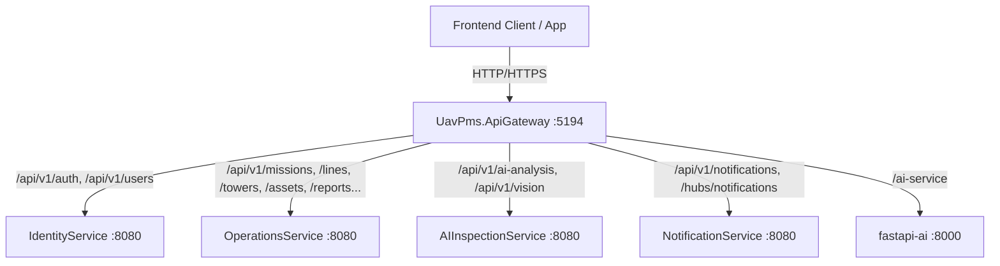

# 📋 TÀI LIỆU ĐẶC TẢ API (API SPECIFICATION) - UAV-PMS SYSTEM

Hệ thống UAV tích hợp AI để kiểm tra, giám sát và quản lý bảo trì hạ tầng lưới điện truyền tải.

---

## 1. QUY ƯỚC CHUNG (GENERAL CONVENTIONS)

- **Base URL Gateway**:
  - **Production**: `https://uavpms.ddns.net`
  - **Local Development**: `http://localhost:5194`
- **Tiền tố API**: `/api/v1` (Hầu hết các endpoints) hoặc `/api/v2` (Dành riêng cho Pre-Mission Assessments v2 & Missions v2).
- **Định dạng dữ liệu**: `application/json` cho request/response tiêu chuẩn, `multipart/form-data` cho upload ảnh/file Excel.
- **Xác thực (Authentication)**: Gửi Bearer JWT Token qua HTTP Request Header:
  ```http
  Authorization: Bearer <access_token>
  ```

> [!WARNING]
> ### QUY TẮC BẮT BUỘC VỀ ID TRÊN PATH (PATH PARAMETERS)
> Mọi tham số `{id}`, `{missionId}`, `{droneId}`, `{userId}`, `{assetId}`, `{towerId}`, v.v. trên URL định tuyến backend đều áp dụng ràng buộc **`guid`** (UUID chuẩn 36 ký tự: `xxxxxxxx-xxxx-xxxx-xxxx-xxxxxxxxxxxx`).
> - ✅ **HỢP LỆ**: `GET /api/v1/missions/3fa85f64-5717-4562-b3fc-2c963f66afa6/assignments`
> - ❌ **LỖI 404 NOT FOUND**: `GET /api/v1/missions/msn-icrfyl/assignments` *(Do `msn-icrfyl` là chuỗi code/text, router ASP.NET không match regex GUID dẫn đến trả về 404 Not Found ngay lập tức).*
>
> **Frontend bắt buộc phải truyền `mission.id` (GUID) thay vì mã `mission.missionCode`!**

---

### Chuẩn Phản hồi (API Response Envelope)
Tất cả các API trả về theo cấu trúc đóng gói thống nhất `ApiResponse`:
```json
{
  "success": true,
  "message": "Thông điệp phản hồi từ máy chủ",
  "data": { ... }
}
```
Trường hợp phân trang (`Pagination`), trường `data` tuân thủ format:
```json
{
  "success": true,
  "message": "Lấy danh sách thành công.",
  "data": {
    "items": [ ... ],
    "totalCount": 120,
    "page": 1,
    "pageSize": 10,
    "totalPages": 12
  }
}
```

---

## 2. PHÂN QUYỀN VAI TRÒ (ROLE-BASED ACCESS CONTROL - RBAC)

Các vai trò được định nghĩa trong hệ thống (`UserRoles`):
- `SystemAdmin`: Quản trị hệ thống, CRUD tài khoản, phân quyền, xem toàn bộ Audit Logs.
- `Manager`: Lập kế hoạch bay, phân công phi công, gán UAV, duyệt báo cáo kiểm định, duyệt kết quả AI.
- `Inspector`: Phi công/kỹ thuật viên bay UAV, nhận nhiệm vụ được giao, check-in hiện trường, bàn giao drone, tải lên ảnh kiểm tra và log bay.
- `Analyst`: Chuyên viên phân tích AI, duyệt/bác bỏ phát hiện khuyết tật của YOLOv8, xử lý cảnh báo sự cố.
- `MaintenanceTechnician` / `Technician`: Kỹ thuật viên bảo trì, kiểm định kỹ thuật drone định kỳ trước chuyến bay.

---

## 3. SƠ ĐỒ ĐIỀU HƯỚNG API GATEWAY (OCELOT)



---

## 4. CHI TIẾT TỪNG MODULE API

---

### MODULE 4.1: XÁC THỰC & BẢO MẬT (IDENTITY - AUTH & OTP)

#### [POST] `/api/v1/auth/login`
- **Mô tả**: Đăng nhập tài khoản bằng email và mật khẩu. Tự động kiểm tra thiết bị tin cậy (`device_trust_token`).
- **Phân quyền**: Public
- **Request Body**:
  ```json
  {
    "email": "admin@uavpms.com",
    "password": "Password123@"
  }
  ```
- **Response `200 OK` (Khi không yêu cầu OTP)**:
  ```json
  {
    "success": true,
    "message": "Success",
    "data": {
      "accessToken": "eyJhbGciOi...",
      "tokenType": "Bearer",
      "refreshToken": "d8a1f81d-6b58-45b7-a3c3-63023e3e2b2a",
      "expiresIn": 3600,
      "deviceTrustToken": "...",
      "user": {
        "id": "e586b4a3-7649-43a9-a9a3-5c742f8c5cf1",
        "email": "admin@uavpms.com",
        "fullName": "System Administrator",
        "roles": ["SystemAdmin"]
      }
    }
  }
  ```
- **Response `200 OK` (Khi yêu cầu OTP trên thiết bị mới)**:
  ```json
  {
    "success": true,
    "message": "OTP required",
    "data": {
      "email": "admin@uavpms.com"
    }
  }
  ```

#### [POST] `/api/v1/auth/refresh-token`
- **Mô tả**: Cấp lại Access Token mới từ Refresh Token.
- **Phân quyền**: Public
- **Request Body**:
  ```json
  {
    "refreshToken": "d8a1f81d-6b58-45b7-a3c3-63023e3e2b2a"
  }
  ```

#### [POST] `/api/v1/auth/otp/send`
- **Mô tả**: Gửi mã OTP xác thực qua email (mục đích: Login, ResetPassword, ChangePassword).
- **Request Body**:
  ```json
  {
    "email": "admin@uavpms.com",
    "purpose": "Login" // hoặc "ResetPassword", "ChangePassword"
  }
  ```

#### [POST] `/api/v1/auth/otp/verify`
- **Mô tả**: Xác thực mã OTP gửi về email.
- **Request Body**:
  ```json
  {
    "email": "admin@uavpms.com",
    "otp": "123456",
    "purpose": "Login"
  }
  ```

#### [POST] `/api/v1/auth/reset-password`
- **Mô tả**: Đặt lại mật khẩu sử dụng `verificationToken` nhận được sau khi verify OTP thành công.
- **Request Body**:
  ```json
  {
    "verificationToken": "valid-token-string",
    "newPassword": "NewPassword123@"
  }
  ```

---

### MODULE 4.2: QUẢN LÝ TÀI KHOẢN NGƯỜI DÙNG (USERS)

#### [GET] `/api/v1/users/me`
- **Mô tả**: Lấy thông tin cá nhân của người dùng hiện tại đang đăng nhập.
- **Phân quyền**: Tất cả vai trò đã đăng nhập

#### [GET] `/api/v1/users`
- **Mô tả**: Danh sách người dùng có phân trang và tìm kiếm.
- **Phân quyền**: `SystemAdmin`
- **Query Parameters**:
  - `page` (int, default: 1)
  - `pageSize` (int, default: 10)
  - `search` (string, optional)

#### [GET] `/api/v1/users/assignable`
- **Mô tả**: Lấy danh sách nhân sự đủ điều kiện phân công bay (Active, vai trò Inspector).
- **Phân quyền**: `SystemAdmin`, `Manager`

#### [GET] `/api/v1/users/{id:guid}`
- **Mô tả**: Lấy thông tin chi tiết một người dùng theo GUID.
- **Phân quyền**: `SystemAdmin`

#### [POST] `/api/v1/users`
- **Mô tả**: Tạo tài khoản người dùng mới.
- **Phân quyền**: `SystemAdmin`
- **Request Body**:
  ```json
  {
    "email": "pilot1@uavpms.com",
    "fullName": "Trần Văn Phi Công",
    "phone": "0987654321",
    "password": "Password123@",
    "roles": ["Inspector"]
  }
  ```

#### [PUT] `/api/v1/users/{id:guid}`
- **Mô tả**: Cập nhật thông tin người dùng và phân quyền vai trò.
- **Phân quyền**: `SystemAdmin`

#### [POST] `/api/v1/users/{id:guid}/suspend`
- **Mô tả**: Tạm khóa hoặc mở khóa tài khoản người dùng.
- **Phân quyền**: `SystemAdmin`

#### [POST] `/api/v1/users/change-password`
- **Mô tả**: Đổi mật khẩu tài khoản hiện tại (yêu cầu Step-Up Token).
- **Request Body**: `{ "newPassword": "NewStrongPassword123@" }`

---

### MODULE 4.3: HẠ TẦNG LƯỚI ĐIỆN & GIS (INFRASTRUCTURE & GIS)

#### [GET] `/api/v1/gis/infrastructure`
- **Mô tả**: Truy vấn toàn bộ dữ liệu đối tượng địa lý hạ tầng lưới điện (Trạm, Tuyến dây, Cột điện) để vẽ lên bản đồ Leaflet/Mapbox.
- **Query Parameters**:
  - `administrativeAreaId` (guid, optional)
  - `managementUnitId` (guid, optional)
  - `powerLineId` (guid, optional)
  - `voltageLevel` (string, optional, ví dụ: "220kV", "500kV")
  - `assetType` (string, optional)
  - `status` (string, optional)

#### [GET] `/api/v1/regions`
- **Mô tả**: Danh sách khu vực quản lý / vùng miền (North, Central, South).
- **Phân quyền**: Mọi vai trò đã đăng nhập
- **Hỗ trợ CRUD**: `GET /{id:guid}`, `POST /`, `PUT /{id:guid}`, `DELETE /{id:guid}` (Yêu cầu `SystemAdmin` hoặc `Manager`).

#### [GET] `/api/v1/substations`
- **Mô tả**: Danh sách trạm biến áp.
- **Query Parameters**: `page`, `pageSize`, `regionAssetId` (guid), `search`.
- **Hỗ trợ CRUD**: `GET /{id:guid}`, `POST /`, `PUT /{id:guid}`, `DELETE /{id:guid}`.

#### [GET] `/api/v1/lines`
- **Mô tả**: Danh sách đường dây truyền tải điện.
- **Query Parameters**: `page`, `pageSize`, `substationAssetId` (guid), `search`.
- **Hỗ trợ CRUD**: `GET /{id:guid}`, `POST /`, `PUT /{id:guid}`, `DELETE /{id:guid}`.

#### [GET] `/api/v1/towers`
- **Mô tả**: Danh sách cột điện truyền tải.
- **Query Parameters**: `page`, `pageSize`, `lineAssetId` (guid).
- **Hỗ trợ CRUD**:
  - `GET /{id:guid}`: Chi tiết cột điện
  - `POST /`: Tạo cột mới (`lineAssetId`, `towerCode`, `latitude`, `longitude`)
  - `PUT /{id:guid}`: Sửa cột điện
  - `DELETE /{id:guid}`: Xóa cột điện
  - `POST /import`: Import danh sách cột hàng loạt từ Excel (`multipart/form-data`)

#### [GET] `/api/v1/assets`
- **Mô tả**: Danh sách thiết bị gắn trên cột/lưới điện (Cách điện, chống sét, chuỗi sứ, thanh xà, dây dẫn...).
- **Query Parameters**:
  - `page`, `pageSize`
  - `towerId` (guid, optional)
  - `assetType` (string, optional)
  - `status` (string, optional)
  - `riskLevel` (string[], optional: `Low`, `Medium`, `High`, `Critical`)
  - `minHealthScore`, `maxHealthScore` (double)
  - `regionId`, `lineId` (guid)
  - `sortBy`, `sortOrder`
- **Hỗ trợ CRUD**: `GET /{id:guid}`, `POST /`, `PUT /{id:guid}`, `DELETE /{id:guid}`.

#### [GET] `/api/v1/assets/health-summary`
- **Mô tả**: Lấy thống kê tổng quan sức khỏe thiết bị (tỷ lệ an toàn, cảnh báo, hỏng hóc).

#### [POST] `/api/v1/assets/spatial-query`
- **Mô tả**: Tìm kiếm tất cả thiết bị nằm trong đa giác không gian địa lý GeoJSON Polygon.
- **Request Body**:
  ```json
  {
    "geometry": {
      "type": "Polygon",
      "coordinates": [[[105.7, 21.0], [105.9, 21.0], [105.9, 21.2], [105.7, 21.2], [105.7, 21.0]]]
    },
    "filters": {
      "powerLineId": "3fa85f64-5717-4562-b3fc-2c963f66afa6",
      "assetType": "Insulator"
    }
  }
  ```

---

### MODULE 4.4: QUẢN LÝ NHIỆM VỤ BAY - VÒNG ĐỜI TOÀN DIỆN (MF01 & MF02)

Toàn bộ các thao tác điều phối, bàn giao, cất cánh, xử lý sự cố và nghiệm thu chuyến bay.

#### [GET] `/api/v1/missions`
- **Mô tả**: Lấy danh sách nhiệm vụ bay có lọc và phân trang.
- **Query Parameters**:
  - `page` (int, default: 1)
  - `pageSize` (int, default: 10)
  - `search` (string, optional)
  - `status` (string, optional: `DRAFT`, `PLANNED`, `DISPATCHED`, `CONFIRMED`, `IN_PROGRESS`, `COMPLETED`, `CANCELLED`, `SUSPENDED`)
  - `sortBy` (string, default: "createdAt")
  - `sortDescending` (bool, default: true)

#### [GET] `/api/v1/missions/{id:guid}`
- **Mô tả**: Lấy đầy đủ thông tin chi tiết một nhiệm vụ bay kèm danh sách phi công, thiết bị mục tiêu, drone được gán.
- **Lưu ý**: `{id}` bắt buộc là GUID.

#### [GET] `/api/v1/missions/my`
- **Mô tả**: Lấy danh sách các nhiệm vụ bay được phân công cho người dùng đang đăng nhập.

#### [POST] `/api/v1/missions`
- **Mô tả**: Tạo mới kế hoạch nhiệm vụ bay (MF01).
- **Phân quyền**: `Manager`, `SystemAdmin`
- **Request Body**:
  ```json
  {
    "title": "Kiểm tra định kỳ tuyến Hòa Bình - Hà Đông đợt 1",
    "regionId": "e1f2a3b4-5678-90ab-cdef-1234567890ab",
    "missionType": "SCHEDULED", // hoặc "AD_HOC"
    "plannedStart": "2026-10-01T08:00:00Z",
    "plannedEnd": "2026-10-01T17:00:00Z",
    "confirmationDeadline": "2026-09-30T17:00:00Z",
    "description": "Bay rà soát chuỗi cách điện và hành lang an toàn",
    "managerInstructions": "Chú ý khu vực khoảng cột 45-50 gió to",
    "droneId": "d186b4a3-7649-43a9-a9a3-5c742f8c5cf3",
    "assignedToUserId": "f186b4a3-7649-43a9-a9a3-5c742f8c5cf2",
    "assignments": [
      {
        "userId": "f186b4a3-7649-43a9-a9a3-5c742f8c5cf2",
        "assignmentRole": "PilotInCommand",
        "isRequired": true
      }
    ]
  }
  ```

#### [PUT] `/api/v1/missions/{id:guid}`
- **Mô tả**: Cập nhật thông tin cơ bản của nhiệm vụ bay (chỉ khi ở trạng thái cho phép).

#### [DELETE] `/api/v1/missions/{id:guid}`
- **Mô tả**: Xóa mềm nhiệm vụ bay.

#### [POST] `/api/v1/missions/{id:guid}/scope/resolve`
- **Mô tả**: Xác định phạm vi bay dựa trên chuỗi WKT ranh giới polygon (`BoundaryWkt`).

#### [PUT] `/api/v1/missions/{id:guid}/assets`
- **Mô tả**: Xác nhận danh sách các thiết bị/cột điện nằm trong mục tiêu kiểm tra của chuyến bay.
- **Request Body**:
  ```json
  {
    "boundaryWkt": "POLYGON((...))",
    "assetIds": ["3fa85f64-5717-4562-b3fc-2c963f66afa6"]
  }
  ```

#### [GET] `/api/v1/missions/{id:guid}/assignments`
- **Mô tả**: Lấy tổng quan danh sách nhân sự tham gia nhiệm vụ bay, vai trò và trạng thái phản hồi (Accepted, Postponed, Pending).

#### [POST] `/api/v1/missions/{id:guid}/assignments`
- **Mô tả**: Thêm nhân sự vào danh sách phân công nhiệm vụ bay.
- **Request Body**:
  ```json
  {
    "userId": "3fa85f64-5717-4562-b3fc-2c963f66afa6",
    "assignmentRole": "Observer" // hoặc "PilotInCommand", "PayloadOperator"
  }
  ```

#### [DELETE] `/api/v1/missions/{id:guid}/assignments/{assignmentId:guid}`
- **Mô tả**: Hủy gán nhân sự khỏi nhiệm vụ.

#### [PUT] `/api/v1/missions/{id:guid}/drone`
- **Mô tả**: Gán thiết bị UAV vào nhiệm vụ bay.
- **Request Body**: `{ "droneId": "3fa85f64-5717-4562-b3fc-2c963f66afa6" }`

#### [POST] `/api/v1/missions/{id:guid}/drone-handover`
- **Mô tả**: Xác nhận biên bản bàn giao drone giữa kho/kỹ thuật và phi công trước/sau chuyến bay.
- **Request Body**:
  ```json
  {
    "droneId": "3fa85f64-5717-4562-b3fc-2c963f66afa6",
    "receivedBy": "3fa85f64-5717-4562-b3fc-2c963f66afa6",
    "condition": "Tốt, 2 pin đầy, camera hoạt động bình thường",
    "accepted": true
  }
  ```

#### [POST] `/api/v1/missions/{id:guid}/check-in`
- **Mô tả**: Phi công check-in hiện trường bằng GPS khi đến vị trí xuất phát.

#### [POST] `/api/v1/missions/{id:guid}/assignments/accept`
- **Mô tả**: Phi công xác nhận chấp nhận nhiệm vụ bay được điều phối.

#### [POST] `/api/v1/missions/{id:guid}/assignments/postpone`
- **Mô tả**: Phi công xin hoãn/từ chối nhiệm vụ kèm lý do chính đáng.
- **Request Body**: `{ "reason": "Thời tiết mưa dông, sức gió cấp 6 không đủ điều kiện an toàn bay" }`

#### [POST] `/api/v1/missions/{id:guid}/start`
- **Mô tả**: Bắt đầu thực hiện chuyến bay (`IN_PROGRESS`).

#### [POST] `/api/v1/missions/{id:guid}/complete`
- **Mô tả**: Kết thúc chuyến bay kiểm tra (`COMPLETED`).

#### [POST] `/api/v1/missions/{id:guid}/cancel`
- **Mô tả**: Hủy nhiệm vụ bay (`CANCELLED`).
- **Request Body**: `{ "reason": "Hủy theo lệnh điều độ điện lực" }`

#### [POST] `/api/v1/missions/{id:guid}/confirm`
- **Mô tả**: Quản lý nghiệm thu và chốt hoàn thành nhiệm vụ.

#### [POST] `/api/v1/missions/{id:guid}/suspend`
- **Mô tả**: Tạm đình chỉ nhiệm vụ do sự cố khẩn cấp.
- **Request Body**: `{ "reason": "Sự cố mất tín hiệu định vị GPS" }`

#### [POST] `/api/v1/missions/{id:guid}/resume`
- **Mô tả**: Khôi phục nhiệm vụ sau khi đình chỉ.

#### [POST] `/api/v1/missions/{id:guid}/remind`
- **Mô tả**: Gửi thông báo nhắc nhở nhân sự xác nhận nhiệm vụ.

#### [GET] & [POST] `/api/v1/missions/{id:guid}/communications`
- **Mô tả**: Nhật ký trao đổi / chat liên lạc nội bộ giữa Manager và Inspector trong suốt chuyến bay.
- **POST Body**: `{ "message": "Đã bay xong khoảng néo 10-15, đang tiến về điểm cột 16." }`

#### [GET] & [POST] `/api/v1/missions/{id:guid}/activities`
- **Mô tả**: Nhật ký các mốc sự kiện hoạt động (Timeline activity log) của nhiệm vụ.

#### [GET] `/api/v1/missions/{id:guid}/detections`
- **Mô tả**: Danh sách toàn bộ các lỗi/bất thường do AI phát hiện trong khuôn khổ nhiệm vụ này.
- **Query Parameters**: `status` (Pending, Confirmed, Rejected), `mediaType` (Image, Video), `isEmergency` (bool).

#### [PUT] `/api/v1/missions/{missionId:guid}/detections/{detectionId:guid}/review`
- **Mô tả**: Thẩm định lỗi do AI phát hiện (Duyệt hoặc Bác bỏ).
- **Request Body**:
  ```json
  {
    "decision": "Confirmed", // hoặc "Rejected"
    "notes": "Vết nứt bề mặt bát sứ rõ ràng, đề xuất thay thế"
  }
  ```

#### [GET] `/api/v1/missions/{id:guid}/maintenance-tasks`
- **Mô tả**: Lấy danh sách phiếu đề xuất sửa chữa/bảo trì phát sinh từ nhiệm vụ bay này.

---

### MODULE 4.5: ĐÁNH GIÁ TIỀN KHẢ THI CHUYẾN BAY (PRE-MISSION ASSESSMENT V2)

Áp dụng cho quy trình thẩm định rủi ro trước bay (Thời tiết, địa hình, tình trạng kỹ thuật thiết bị, năng lực phi công).

- **Base Route**: `/api/v2/pre-mission-assessments`

#### [POST] `/api/v2/pre-mission-assessments`
- **Mô tả**: Tạo hồ sơ đánh giá tiền khả thi.
- **Request Body**:
  ```json
  {
    "regionId": "3fa85f64-5717-4562-b3fc-2c963f66afa6",
    "plannedStart": "2026-10-05T08:00:00Z",
    "plannedEnd": "2026-10-05T16:00:00Z",
    "assetIds": ["3fa85f64-5717-4562-b3fc-2c963f66afa6"],
    "boundaryWkt": "POLYGON((...))",
    "idempotencyKey": "unique-uuid-key"
  }
  ```

#### [GET] `/api/v2/pre-mission-assessments`
- **Mô tả**: Danh sách hồ sơ đánh giá (`status`: Draft, Evaluated, Ready, Rejected).

#### [GET] `/api/v2/pre-mission-assessments/{id:guid}`
- **Mô tả**: Lấy chi tiết hồ sơ thẩm định và điểm số rủi ro.

#### [POST] `/api/v2/pre-mission-assessments/{id:guid}/evaluate`
- **Mô tả**: Kích hoạt động cơ tự động tính toán ma trận rủi ro tiền khả thi (AI / Quy tắc an toàn).

#### [POST] `/api/v2/pre-mission-assessments/{id:guid}/create-mission`
- **Mô tả**: Khởi tạo nhiệm vụ bay chính thức từ hồ sơ thẩm định đạt tiêu chuẩn.
- **Request Body**:
  ```json
  {
    "assessmentId": "3fa85f64-5717-4562-b3fc-2c963f66afa6",
    "title": "Chuyến bay được duyệt từ đánh giá PMA-2026-001",
    "inspectorId": "3fa85f64-5717-4562-b3fc-2c963f66afa6",
    "droneId": "3fa85f64-5717-4562-b3fc-2c963f66afa6"
  }
  ```

---

### MODULE 4.6: QUẢN LÝ THIẾT BỊ DRONE & KIỂM ĐỊNH KỸ THUẬT

#### [GET] `/api/v1/drones`
- **Mô tả**: Lấy danh sách toàn bộ thiết bị Drone trong hệ thống.

#### [GET] `/api/v1/drones/available`
- **Mô tả**: Lấy danh sách Drone đang rảnh rỗi (sẵn sàng phân công).

#### [GET] `/api/v1/drones/{id:guid}` & `/api/v1/drones/{id:guid}/status`
- **Mô tả**: Lấy trạng thái hoạt động, pin, firmware và vị trí gần nhất của drone.

#### [POST] `/api/v1/drone-technical-inspections`
- **Mô tả**: Kỹ thuật viên nộp phiếu kiểm tra kỹ thuật định kỳ / trước bay cho Drone.
- **Phân quyền**: `MaintenanceTechnician`, `Technician`, `Manager`, `SystemAdmin`.
- **Request Body**:
  ```json
  {
    "droneId": "3fa85f64-5717-4562-b3fc-2c963f66afa6",
    "passed": true,
    "inspectorNotes": "Cánh quạt mới thay, gimbal cân bằng tốt, cảm biến va chạm hoạt động chuẩn.",
    "metrics": [
      { "metricName": "BatteryCycles", "metricValue": "24", "unit": "cycles" },
      { "metricName": "PropellerWear", "metricValue": "0.02", "unit": "mm" }
    ]
  }
  ```

#### [GET] `/api/v1/drone-technical-inspections/drone/{droneId:guid}/latest`
- **Mô tả**: Lấy kết quả kiểm định kỹ thuật gần nhất của drone để kiểm tra điều kiện an toàn cất cánh.

#### [POST] `/api/v1/devices/register` & `[POST] /api/v1/devices/heartbeat`
- **Mô tả**: Đăng ký thiết bị phần cứng / gửi nhịp tim định kỳ duy trì trạng thái online.

---

### MODULE 4.7: NẠP DỮ LIỆU ẢNH KIỂM TRA HIỆN TRƯỜNG (INSPECTION DATA)

#### [POST] `/api/v1/inspections/upload`
- **Mô tả**: Tải lên hình ảnh chụp từ UAV kiểm tra hiện trường. Hệ thống lưu trữ ảnh và tự động bắn event kích hoạt worker AI phân tích.
- **Phân quyền**: `Inspector`
- **Content-Type**: `multipart/form-data`
- **Form Fields**:
  - `file` (File, binary): Tệp hình ảnh JPG/PNG độ phân giải cao
  - `missionId` (Guid, required): GUID của nhiệm vụ bay
  - `assetId` (Guid, required): GUID của thiết bị lưới điện tương ứng
  - `capturedAt` (DateTime, required): Thời điểm chụp ảnh
  - `latitude` (double, optional): Tọa độ vĩ độ
  - `longitude` (double, optional): Tọa độ kinh độ

#### [GET] `/api/v1/inspections/report/{id:guid}`
- **Mô tả**: Lấy chi tiết báo cáo kết quả ảnh kiểm tra theo GUID.

#### [GET] `/api/v1/inspections/mission/{missionId:guid}`
- **Mô tả**: Lấy danh sách toàn bộ ảnh và kết quả kiểm tra của một nhiệm vụ bay.

#### [GET] `/images/{fileName}`
- **Mô tả**: Truy xuất trực tiếp ảnh kiểm tra tĩnh được lưu trên máy chủ / volume.

---

### MODULE 4.8: PHÂN TÍCH AI & EDGE VISION BRIDGE

#### [GET] `/api/v1/missions/{missionId:guid}/ai-analysis/detections`
- **Mô tả**: Lấy toàn bộ danh sách bounding box và nhãn lỗi AI phát hiện trên các ảnh thuộc nhiệm vụ.

#### [POST] `/api/v1/missions/{missionId:guid}/ai-analysis/from-media/{mediaId:guid}`
- **Mô tả**: Yêu cầu AI phân tích lại một ảnh kiểm tra đã có.
- **Query Parameters**: `analysisType` (General, Thermal, Defect), `preferredModel` (SERVER / EDGE).

#### [PUT] `/api/v1/missions/{missionId:guid}/ai-analysis/detections/{detectionId:guid}/review`
- **Mô tả**: Analyst duyệt hoặc từ chối một bounding box phát hiện của AI.

#### [POST] `/api/v1/vision/detections` & `[POST] /api/v1/vision/detections/json`
- **Mô tả**: Endpoint dành riêng cho thiết bị Edge AI trên drone gửi kết quả suy luận real-time kèm tọa độ về backend qua HTTP/Gateway.

---

### MODULE 4.9: DASHBOARD GIÁM SÁT & CẢNH BÁO (MONITOR)

- **Base Route**: `/api/v1/monitor`

| Method | Endpoint | Quyền hạn | Mô tả |
|---|---|---|---|
| `GET` | `/summary` | Admin, Manager | Tổng quan số liệu dashboard: tổng nhiệm vụ, tổng sự cố, tỷ lệ hoàn thành |
| `GET` | `/recent-defects` | Admin, Manager, Analyst | Danh sách các khuyết tật thiết bị mới phát hiện gần nhất |
| `GET` | `/defects-statistics` | Admin, Manager, Analyst | Thống kê số lượng khuyết tật theo phân loại (Sứ, dây, cột...) |
| `GET` | `/mission-status` | Admin, Manager | Biểu đồ trạng thái nhiệm vụ bay (Planned, Running, Done) |
| `GET` | `/inspections` | Admin, Manager, Analyst | Lịch sử kiểm tra ảnh kèm bộ lọc ngày và tình trạng có lỗi hay không |
| `GET` | `/alerts` | Admin, Manager, Analyst | Danh sách các cảnh báo khẩn cấp (Emergency Alerts) đang kích hoạt |

---

### MODULE 4.10: BÁO CÁO QUẢN TRỊ (MANAGEMENT REPORTS)

Quản lý chu trình soạn thảo, phê duyệt và xuất bản báo cáo kỹ thuật.

- **Base Route**: `/api/v1/reports`

#### [GET] `/api/v1/reports`
- **Mô tả**: Danh sách báo cáo có phân trang.
- **Query Parameters**: `page`, `pageSize`, `type`, `status` (draft, pending, approved, rejected), `transmissionLineId`, `substationId`, `search`.

#### [POST] `/api/v1/reports`
- **Mô tả**: Tạo mới bản thảo báo cáo quản trị.
- **Request Body**:
  ```json
  {
    "title": "Báo cáo kiểm định sự cố tuyến dây 220kV tháng 10",
    "type": "InspectionSummary",
    "transmissionLineId": "3fa85f64-5717-4562-b3fc-2c963f66afa6",
    "missionIds": ["3fa85f64-5717-4562-b3fc-2c963f66afa6"],
    "description": "Tổng hợp kết quả bay 5 đợt trong tuần qua",
    "dateFrom": "2026-10-01T00:00:00Z",
    "dateTo": "2026-10-07T23:59:59Z"
  }
  ```

#### [PUT] `/api/v1/reports/{id:guid}/submit`
- **Mô tả**: Trình báo cáo lên cấp quản lý phê duyệt (`draft` -> `pending`).

#### [PUT] `/api/v1/reports/{id:guid}/approve`
- **Mô tả**: Quản lý phê duyệt báo cáo (`pending` -> `approved`).

#### [PUT] `/api/v1/reports/{id:guid}/reject`
- **Mô tả**: Từ chối báo cáo kèm lý do cần sửa đổi.
- **Request Body**: `{ "reason": "Cần bổ sung số liệu phân tích ảnh nhiệt ở khoảng néo 12" }`

#### [POST] `/api/v1/reports/{id:guid}/generate`
- **Mô tả**: Yêu cầu hệ thống sinh file PDF hoặc Excel.
- **Query Parameter**: `format` (`pdf` hoặc `excel`).

#### [GET] `/api/v1/reports/{id:guid}/download`
- **Mô tả**: Tải về tệp báo cáo PDF/Excel đã được sinh.

---

### MODULE 4.11: NHẬT KÝ KIỂM TOÁN HỆ THỐNG (AUDIT LOGS)

#### [GET] `/api/v1/audit-logs`
- **Mô tả**: Xem lịch sử truy vết thay đổi dữ liệu của hệ thống (Ai đã thêm, sửa, xóa bản ghi nào, IP nào, thời điểm nào, chi tiết giá trị cũ/mới).
- **Phân quyền**: `SystemAdmin`, `Manager`
- **Query Parameters**:
  - `page` (int, default: 1)
  - `pageSize` (int, default: 10)
  - `search` (string, optional)
  - `tableName` (string, optional, ví dụ: "Missions", "Assets")
  - `actionType` (string, optional: "Added", "Modified", "Deleted")

---

### MODULE 4.12: THÔNG BÁO & SIGNALR REAL-TIME (NOTIFICATIONS)

#### [GET] `/api/v1/notifications` hoặc `/api/v1/notifications/history`
- **Mô tả**: Lấy danh sách thông báo của người dùng hiện tại (hỗ trợ param `limit`).
- **Phân quyền**: Tất cả vai trò đã đăng nhập

#### [PUT] `/api/v1/notifications/{id:guid}/read`
- **Mô tả**: Đánh dấu thông báo là đã đọc.

#### [POST] `/api/v1/notifications/schedule`
- **Mô tả**: Lên lịch gửi thông báo qua Hangfire (`DelaySeconds` hoặc `ScheduleTime`).

#### [POST] `/api/v1/notifications/enqueue-email`
- **Mô tả**: Đưa tác vụ gửi email vào hàng đợi nền Hangfire.

#### SignalR Hub: `/hubs/notifications`
- **Mô tả**: Kết nối WebSocket nhận thông báo đẩy tức thì.
- **Cách kết nối từ Frontend**:
  ```typescript
  import * as signalR from '@microsoft/signalr';

  const connection = new signalR.HubConnectionBuilder()
    .withUrl('https://uavpms.ddns.net/hubs/notifications', {
      accessTokenFactory: () => authService.getAccessToken()
    })
    .withAutomaticReconnect()
    .build();

  // Nhận thông báo chung
  connection.on('ReceiveNotification', (notification) => {
    console.log('Thông báo mới:', notification);
  });

  // Nhận sự kiện vòng đời chuyến bay
  connection.on('MissionLifecycleEvent', (event) => {
    console.log('Sự kiện chuyến bay:', event);
  });
  ```
